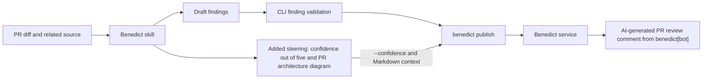

# Benedict

Benedict is a code review skill and an Effect TypeScript CLI for coding agents. The skill guides the investigation of correctness and security defects. The CLI gathers Git context, validates findings against source evidence and repository policy, and publishes AI-labeled reviews to GitHub through the Benedict GitHub App. All AI inference runs locally in your coding agent; the shared Benedict service only posts the result.

Benedict is a cat who reviews code. He reads the change, reports only defects he can quote from the source, and when a PR comes back clean, he approves it on GitHub.

## Install

Requires Node.js 22.20 or newer and Git. Install from GitHub: `npm pack` downloads the repository and builds the CLI into a tarball, which is then installed globally:

```sh
cd "$(mktemp -d)"
npm install --global "./$(npm pack --silent github:josh-borseth-fp-ai/benedict)"
benedict --help
benedict setup
```

Append `#<tag-or-commit>` to the `github:` spec to install a specific version, and rerun the install to upgrade. Installing the `github:` spec directly with `--global` fails because npm skips the build tools in that case. The package is not published to a registry.

From a local checkout, `npm ci && npm install --global .` installs the same build, and `npm run benedict -- context --repo /path/to/project` runs it without a global install. If your global npm directory is not writable, add `--prefix "$HOME/.local"` to the install and put `$HOME/.local/bin` on your PATH.

## Use it with a coding agent

The skill is [`.agents/skills/benedict/SKILL.md`](.agents/skills/benedict/SKILL.md).

Run `benedict setup` to install the bundled skill for your coding agents across projects. Setup delegates agent detection and selection to the bundled [Vercel skills installer](https://github.com/vercel-labs/skills). Use `benedict setup --project` inside a Git repository for project installation. For unattended setup, pass `--yes` and explicit `--agent` IDs (repeat the flag for multiple agents). The skill and reference files come from the installed CLI release; rerun setup after upgrading it.

You can also copy the skill folder into `.agents/skills/benedict/` or point a coding agent directly at it. Ask the coding agent to load the skill and follow its instructions to review a change, a commit, a branch, or a pull request.

The coding agent runs `benedict context`, reads the changed code and related callers and tests, and writes findings as JSON. It then runs `benedict check` and reports the accepted findings. For GitHub PR reviews, it also runs `benedict publish` unless you ask for a local-only review. The skill includes [command and finding format guidance](.agents/skills/benedict/references/cli.md).

Every review includes **Confidence: N/5** and a brief explanation of confidence that the change is safe to merge. Each PR review also includes a Mermaid diagram of its changed components and architecture, even if no findings clear the reporting threshold. The coding agent chooses the score and traces the diagram from the reviewed code; the CLI sends the score with `--confidence` and the diagram as Markdown context. Individual finding confidence remains on the 0–1 scale.



This diagram shows how Benedict carries the new report content. The diagram generated for a reviewed PR describes that PR's own changes.

For PRs with meaningful UI changes, the skill also checks screenshots and a focused video showing the changed screen and, when runnable, the interaction and result. The implementation agent captures and attaches this evidence when opening the PR; the reviewer reuses current evidence or requests what is missing. The [UI evidence workflow](.agents/skills/benedict/references/ui-evidence.md) uses browser/computer-use recording tools, keeps clips focused on the PR's purpose, and covers GitHub uploads and unavailable interactions. The reviewer remains read-only and does not spawn another agent.

Uploaded evidence URLs, demonstrated behavior, captured commit, and verification gaps travel through `--context-file`. The CLI preserves those Markdown links but does not record video or upload files. Capture and upload require suitable tools; the installed GitHub CLI must support attachments or another supported uploader is needed. Local-only reviews retain local artifacts and make no GitHub writes. PRs without visible UI changes do not require media.

## Commands

```sh
# Review the previous commit through HEAD.
benedict context --repo /path/to/project

# Select a different commit range.
benedict context --base main --head HEAD

# Review staged, unstaged and untracked files against HEAD.
benedict context --worktree

# Validate the coding agent's drafts against the same range.
benedict check /tmp/findings.json --base main --head HEAD

# Read a human-readable report.
benedict check /tmp/findings.json --format text
```

Both commands default to JSON output. `context` returns resolved commit hashes, changed files, patches, line counts, changed lines, permitted review lenses, and rules. Use those hashes with `check` to keep a commit review on the same range even if branches move. Worktree reviews read the current files on each invocation.

`check` accepts an array of findings or an object with a `findings` array:

```json
{
  "findings": [
    {
      "file": "src/auth.ts",
      "startLine": 12,
      "endLine": 12,
      "severity": "high",
      "skill": "security",
      "title": "Missing authentication check",
      "explanation": "Explain the triggering input and resulting defect using repository evidence.",
      "quote": "return privateData;",
      "confidence": 0.9
    }
  ]
}
```

The example quote must be replaced with the actual source in your review. Paths are relative to the repository root, and line numbers refer to the selected head or current worktree. `suggestedFix` is an optional string.

The result contains `accepted`, `rejected` with original draft indices and rejection reasons, and a count summary. Validation checks finding structure, membership in the diff, supported file type, line bounds, quote presence within that range, permitted lenses, severity, confidence, and duplicates. For duplicates with the same file, start line, and title, the highest valid confidence wins; ties keep the first draft.

Exit codes: **0** means all drafts passed, including an empty list; **1** means at least one draft was rejected; **2** means an input, configuration, or command error prevented validation. Operational errors go to stderr. Finding acceptance establishes evidence and policy compliance; the coding agent still determines whether the behavior is a real defect.

`context` and `check` read the reviewed repository without modifying it or fetching remote knowledge. `context --pr` may fetch missing PR commits from the matching GitHub remote; it adds objects only and does not move branches or change files. They exclude source findings on deleted files, binaries, symlinks, and submodules, and disable external Git diff and text conversion drivers. `setup` and `sync` explicitly manage installation, configuration, and knowledge locks.

## GitHub publishing

Install [GitHub CLI](https://cli.github.com/) and sign in with `gh auth login`. The Benedict CLI uses `gh api` only to read PRs; authentication stays with `gh`. Every GitHub write goes through the [Benedict service](app-service/README.md), which posts as the organization's Benedict GitHub App. Set the service URL and key through your normal local configuration:

```sh
export BENEDICT_SERVICE_URL=https://benedict.example.com
# Configure BENEDICT_SERVICE_KEY through your normal secret configuration.
```

Review the PR's merge base through its head commit. `benedict context --pr` resolves that range with `gh`, fetches the commits if they are missing locally, and reads the diff from Git:

```sh
benedict context --repo /path/to/project --pr https://github.com/OWNER/REPO/pull/NUMBER
```

See the [PR workflow](.agents/skills/benedict/references/cli.md#github-pr-workflow) for details. Publish the same resolved range:

```sh
# Preview the exact comment. This reads PR metadata and does not contact the service.
benedict publish /tmp/findings.json \
  --pr https://github.com/OWNER/REPO/pull/NUMBER \
  --base <reviewed-base-hash> --head <reviewed-head-hash> \
  --context-file /tmp/review-context.md --confidence 4 --dry-run --format text

# Post it as the Benedict GitHub App.
benedict publish /tmp/findings.json \
  --pr https://github.com/OWNER/REPO/pull/NUMBER \
  --base <reviewed-base-hash> --head <reviewed-head-hash> \
  --context-file /tmp/review-context.md --confidence 4
```

The CLI validates the findings and range locally, then sends the validated review to the service. The service renders the comment and posts it as `benedict[bot]`. The comment is headed **AI-generated review** and identifies **Benedict**. It includes validated findings, source links, the reviewed commits, the organization knowledge revision when configured, the overall confidence, and Markdown context containing the rationale and a Mermaid diagram of the PR's changes. Relevant checks and verified behavior can accompany that context. Rejected drafts are counted but their contents are omitted.

The app keeps one marked review comment per PR, whichever developer publishes. Later runs update it, and identical content is left unchanged. Human comments and other authors' comments are untouched. The CLI and the service both verify that the reviewed range belongs to the PR, and the service rechecks PR metadata immediately before writing. The comment records its exact reviewed commit.

The CLI keeps `--context-file` optional for direct callers; the skill requires it for PR reviews so the rationale and diagram are included. The CLI preserves this Markdown, and [GitHub renders fenced Mermaid blocks](https://docs.github.com/en/get-started/writing-on-github/working-with-advanced-formatting/creating-diagrams). `publish` accepts draft findings in the same format as `check` and revalidates them. If omitted, the base defaults to the PR merge base and the head to local `HEAD`; those commits must be available locally. `--repo` and `--config` work as in `check`. Worktree findings must be reviewed again after committing before publication.

`publish` returns the action, comment URL, posting account, stamp outcome, exact body and counts as JSON, or readable text with `--format text`. Exit 0 means publication or preview succeeded. Exit 1 means the review was published but a requested stamp was refused. Exit 2 means publication failed. The CLI never retries automatically; after an uncertain service error, rerunning the same command is safe. Comments above 60,000 bytes fail for shortening.

## Optional config

A `.benedict/config.json` in the reviewed repository chooses which lenses apply to which paths and sets the severity and confidence floor. Review configuration is JSON only:

```json
{
  "$schema": "https://raw.githubusercontent.com/josh-borseth-fp-ai/benedict/main/schemas/config.schema.json",
  "skills": ["correctness", "security"],
  "minimumSeverity": "medium",
  "minimumConfidence": 0.7,
  "paths": [{ "pattern": "api/**", "skills": ["security"] }],
  "rules": [
    "Do not report style-only issues.",
    "Prefer repository evidence over assumptions."
  ]
}
```

The optional `$schema` key enables editor completion and validation from [`schemas/`](schemas/). The CLI's own decoder remains authoritative and rejects unknown keys.

Patterns match repository-relative paths with forward slashes: `api/**` covers `api/v1/auth.ts`, while `*.ts` only covers files at the root. Matching path rules combine their lenses and are restricted by the global `skills` list. Unmatched paths use the global list. An empty lens list disables optional checks; organization-required lenses still apply. Defaults are correctness and security, minimum severity `medium`, and minimum confidence `0.7`.

Configuration is read from the current working tree, including for commit reviews. `--config other.json` selects a different JSON file. A relative config path resolves from the repository root; a findings input path resolves from the shell's current directory. Invalid config fails the command rather than silently using defaults. Free-text rules guide the coding agent's judgment.

## Shared knowledge

Keep repository knowledge with the code and organization knowledge in a dedicated Git repository. For example, a project's `.benedict/config.json` can declare:

```json
{
  "organization": { "source": "https://github.com/your-org/engineering-knowledge.git", "ref": "main" },
  "knowledge": ["docs/architecture.md", "docs/testing.md"]
}
```

The organization repository has a `.benedict/organization.json` manifest:

```json
{
  "$schema": "https://raw.githubusercontent.com/josh-borseth-fp-ai/benedict/main/schemas/organization.schema.json",
  "defaults": { "skills": ["correctness", "security"], "minimumConfidence": 0.8 },
  "required": {
    "skills": ["security"],
    "minimumSeverity": "medium",
    "minimumConfidence": 0.75,
    "rules": ["Never expose credentials in logs."]
  },
  "knowledge": ["knowledge/engineering.md"]
}
```

`defaults` and `required` use the same policy field names as the repository config. Because the manifest has its own filename, the organization repository can also keep a `.benedict/config.json` for reviews of its own changes.

Repo settings override organization defaults field by field. Required lenses always apply, including to paths that narrow optional checks. Repo thresholds or global lens settings that weaken declared requirements are configuration errors. Required free-text rules are retained when repo rules replace defaults; the coding agent evaluates those rules.

```sh
# Connect a project and install the Benedict skill.
benedict setup --organization https://github.com/your-org/engineering-knowledge.git --ref main

# Populate a new machine's cache using the project's committed lock.
benedict sync

# Explicitly adopt a newer approved organization revision.
benedict sync --update
```

Commit `.benedict/config.json`, `.benedict/knowledge.lock.json`, and repo knowledge docs with the project. Initial sync creates the lock. Subsequent syncs restore that exact revision; `--update` resolves the configured ref again and changes the lock after validating the new policy. Failed updates preserve the previous lock. Setup can run from outside Git to install a user-wide skill; connecting organization knowledge requires a project. `--skip-skills` configures/syncs knowledge without installing the skill.

Knowledge is cached outside the project, in `$XDG_CACHE_HOME/benedict` or `~/.cache/benedict` on Unix and the local app-data directory on Windows; `BENEDICT_CACHE_DIR` overrides it. Private repositories use Git's existing authentication. Review commands use the locked cache offline and report an actionable error if it is missing. Context includes both scopes' document contents and the organization revision; check reports identify that revision too.

Knowledge changes follow the normal Git review process. Agents can propose additions, and approved commits become shared knowledge. The CLI reads declared Markdown files and never executes organization code. See the [knowledge reference](.agents/skills/benedict/references/knowledge.md) for schemas, limits, and update behavior.

## Develop

```sh
npm ci
npm run typecheck
npm test
npm run build
```

After changing the config schemas in `src/model.ts`, run `npm run schemas` to regenerate `schemas/*.schema.json`; a test fails while they are stale.

The integration tests run the built executable against temporary repositories and isolated home directories. Publishing tests use a fake `gh` executable and a fake Benedict service; service tests use a fake GitHub. None post live comments or approvals. `npm pack` builds an installable archive containing the CLI and skill.

## Stamp a PR

A stamp is a GitHub approval from the organization's **Benedict** GitHub App, based on the review your local agent just completed. The agent requests it while publishing the whole-PR review:

```sh
benedict publish /tmp/findings.json --repo /path/to/project \
  --pr https://github.com/ORG/REPO/pull/123 \
  --base <reviewed-merge-base> --head <reviewed-head> \
  --context-file /tmp/review-context.md --confidence 4 --stamp
```

A PR qualifies when the review has **zero accepted findings** and an **overall confidence of 4/5 or 5/5**. The service posts the review first. It then reads the stamp settings from the base branch's `.benedict/config.json`, checks the stamp conditions against GitHub and approves as `<app>[bot]` at the reviewed commit, labelled **Benedict — automated approval** and linking the review comment.

```json
{
  "stamp": {
    "enabled": true,
    "denyPaths": ["infra/**", ".github/workflows/**"],
    "maxChangedLines": 400
  }
}
```

Stamp settings belong on the base branch, so a PR cannot enable its own stamping. The app's installation determines which repositories it can post to and stamp.

The service refuses a stamp for:

- draft PRs, and reviews that do not cover the whole current PR;
- accepted findings, or confidence below 4/5;
- stamping not enabled on the base branch;
- protected paths and changes over the size limit.

Everything under `.benedict/` (config and organization lock) and the Benedict skill are protected by default. Binary or unavailable text patches require manual review. A refused stamp still publishes the review; `publish` reports the reason and exits 1.

Repeated requests are safe. The service returns `already-approved` when the bot already approved that commit. It refuses when that approval was dismissed. After a timeout, rerun the same command.

Whether the bot's approval satisfies branch requirements depends on repository rules. A GitHub App cannot be a code owner, so required code-owner reviews still need a person. Enable dismissal of stale approvals so new commits need a new review.

To require a review and stamp on every PR, add this to a repository's `AGENTS.md`:

```md
## Benedict

After opening a PR or pushing to one, use the `benedict` skill to review the whole
current PR, publish the review, and stamp it. Fix accepted findings and repeat.
If the stamp is refused, report the reason and request human review; do not
approve the PR another way.
```

Anyone with the service key can publish reviews and request stamps, including for their own PR. The base-branch rules, bot attribution, linked review comment and stale-approval dismissal limit that and make it visible. Rotate the key when someone leaves. Mechanical validation cannot prove the AI's defect assessment; the approval depends on the completed review.

Service tests are part of `npm test`, and can also be run with:

```sh
node --import tsx --test tests/app-service.test.ts
```
