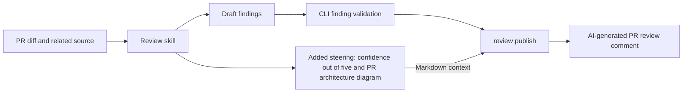

# Review

A code review skill and an Effect TypeScript CLI for coding agents. The skill guides the investigation of correctness and security defects. The CLI gathers Git context, validates findings against source evidence and repository policy, and publishes AI-labeled reviews to GitHub.

## Install

Requires Node.js 22 or newer and Git. From a local checkout of this repository:

```sh
npm ci
npm run build
npm install --global .
review --help
```

You can also run it from the checkout without a global install:

```sh
npm run review -- context --repo /path/to/project
```

The package is built for local installation; it has not been published to a registry.

## Use it with a coding agent

The skill is [`.agents/skills/review/SKILL.md`](.agents/skills/review/SKILL.md).

Copy that folder into the project you want reviewed, at `.agents/skills/review/`, or point your coding agent at the file. Ask the coding agent to load the skill and follow its instructions to review a change, a commit, a branch, or a pull request.

The coding agent runs `review context`, reads the changed code and related callers and tests, and writes findings as JSON. It then runs `review check` and reports the accepted findings. For a GitHub PR review, it also runs `review publish` to share findings and useful context unless you ask for a local-only review. The skill includes [command and finding format guidance](.agents/skills/review/references/cli.md).

Every review includes **Confidence: N/5** and a brief explanation of confidence that the change is safe to merge. Each PR review also includes a Mermaid diagram of its changed components and architecture, even if no findings clear the reporting threshold. The coding agent chooses the score and traces the diagram from the reviewed code; the CLI posts them as Markdown context. Individual finding confidence remains on the 0–1 scale.



This diagram shows how the review tool carries the new report content. The diagram generated for a reviewed PR describes that PR's own changes.

For PRs with meaningful UI changes, the skill also checks screenshots and a focused video showing the changed screen and, when runnable, the interaction and result. The implementation agent captures and attaches this evidence when opening the PR; the reviewer reuses current evidence or requests what is missing. The [UI evidence workflow](.agents/skills/review/references/ui-evidence.md) uses browser/computer-use recording tools, keeps clips focused on the PR's purpose, and covers GitHub uploads and unavailable interactions. The reviewer remains read-only and does not spawn another agent.

Uploaded evidence URLs, demonstrated behavior, captured commit, and verification gaps travel through `--context-file`. The CLI preserves those Markdown links but does not record video or upload files. Capture and upload require suitable tools; the installed GitHub CLI must support attachments or another supported uploader is needed. Local-only reviews retain local artifacts and make no GitHub writes. PRs without visible UI changes do not require media.

## Commands

```sh
# Review the previous commit through HEAD.
review context --repo /path/to/project

# Select a different commit range.
review context --base main --head HEAD

# Review staged, unstaged and untracked files against HEAD.
review context --worktree

# Validate the coding agent's drafts against the same range.
review check /tmp/findings.json --base main --head HEAD

# Read a human-readable report.
review check /tmp/findings.json --format text
```

Both commands default to JSON output. `context` returns resolved commit hashes, changed files, patches, line counts, changed lines, permitted review lenses, and rules. Use those hashes with `check` to keep a commit review on the same range even if branches move. Worktree reviews read the current files on each invocation.

`check` accepts an array of findings or an object with a `findings` array:

```json
{
  "findings": [
    {
      "file": "src/auth.ts",
      "startLine": 12,
      "endLine": 12,
      "severity": "high",
      "skill": "security",
      "title": "Missing authentication check",
      "explanation": "Explain the triggering input and resulting defect using repository evidence.",
      "quote": "return privateData;",
      "confidence": 0.9
    }
  ]
}
```

The example quote must be replaced with the actual source in your review. Paths are relative to the repository root, and line numbers refer to the selected head or current worktree. `suggestedFix` is an optional string.

The result contains `accepted`, `rejected` with original draft indices and rejection reasons, and a count summary. Validation checks finding structure, membership in the diff, supported file type, line bounds, quote presence within that range, permitted lenses, severity, confidence, and duplicates. For duplicates with the same file, start line, and title, the highest valid confidence wins; ties keep the first draft.

Exit codes: **0** means all drafts passed, including an empty list; **1** means at least one draft was rejected; **2** means an input, configuration, or command error prevented validation. Operational errors go to stderr. Finding acceptance establishes evidence and policy compliance; the coding agent still determines whether the behavior is a real defect.

The CLI reads the reviewed repository without modifying its files. It excludes source findings on deleted files, binaries, symlinks, and submodules, and disables external Git diff and text conversion drivers.

## GitHub publishing

Install [GitHub CLI](https://cli.github.com/) and sign in with `gh auth login`. The review CLI uses `gh api` for GitHub access; authentication stays with `gh`.

Review the PR's merge base through its head commit, using the [PR workflow](.agents/skills/review/references/cli.md#github-pr-workflow) to obtain those hashes. Publish the same resolved range:

```sh
# Preview the exact comment. This reads PR metadata and makes no GitHub writes.
review publish /tmp/findings.json \
  --pr https://github.com/OWNER/REPO/pull/NUMBER \
  --base <reviewed-base-hash> --head <reviewed-head-hash> \
  --context-file /tmp/review-context.md --dry-run --format text

# Publish it using your signed-in GitHub account.
review publish /tmp/findings.json \
  --pr https://github.com/OWNER/REPO/pull/NUMBER \
  --base <reviewed-base-hash> --head <reviewed-head-hash> \
  --context-file /tmp/review-context.md
```

The comment is headed **AI-generated review** and identifies the **review skill and CLI automated reviewer**. GitHub displays the signed-in account as the uploader; the comment explicitly identifies AI authorship. It includes validated findings, source links, the reviewed commits, and Markdown context containing the overall confidence score, rationale, and a Mermaid diagram of the PR's changes. Relevant checks and verified behavior can accompany that context. Rejected drafts are counted but their contents are omitted.

Each account maintains one marked review comment per PR. Subsequent runs update that comment; identical content is left unchanged. Human comments and other authors' comments are untouched. Publication verifies the reviewed range belongs to the PR and rechecks PR metadata immediately before writing. Publish sequentially: concurrent runs can race, and the metadata check and write are not atomic. The comment records its exact reviewed commit.

The CLI keeps `--context-file` optional for direct callers; the skill requires it for PR reviews so the score and diagram are included. The CLI preserves this Markdown, and [GitHub renders fenced Mermaid blocks](https://docs.github.com/en/get-started/writing-on-github/working-with-advanced-formatting/creating-diagrams). `publish` accepts draft findings in the same format as `check` and revalidates them. If omitted, the base defaults to the PR merge base and the head to local `HEAD`; those commits must be available locally. `--repo` and `--config` work as in `check`. Worktree findings must be reviewed again after committing before publication.

`publish` returns the comment URL, exact body, counts, and action as JSON, or readable text with `--format text`. Exit 0 means publication or preview succeeded; exit 2 means it failed. It uses GitHub PR conversation comments. A lost write response may hide a successful post, so errors explain when to inspect the PR before retrying. Comments above 60,000 bytes fail for shortening. The CLI never automatically retries GitHub writes.

## Optional config

A `review.yaml`, `review.yml`, or `review.json` at the reviewed repository root chooses which lenses apply to which paths and sets the severity and confidence floor:

```yaml
skills: [correctness, security]
severity:
  minimum: medium
minimumConfidence: 0.7
paths:
  - pattern: "api/**"
    skills: [security]
rules:
  - Do not report style-only issues.
  - Prefer repository evidence over assumptions.
```

Patterns match repository-relative paths with forward slashes: `api/**` covers `api/v1/auth.ts`, while `*.ts` only covers files at the root. Matching path rules combine their lenses and are restricted by the global `skills` list. Unmatched paths use the global list. An empty lens list disables those checks. Defaults are correctness and security, minimum severity `medium`, and minimum confidence `0.7`.

Configuration is read from the current working tree, including for commit reviews. If multiple config files exist, choose one with `--config review.yaml`. A relative config path resolves from the repository root; a findings input path resolves from the shell's current directory. Invalid config fails the command rather than silently using defaults. Free-text rules guide the coding agent's judgment.

## Develop

```sh
npm ci
npm run typecheck
npm test
npm run build
```

The integration tests run the built executable against temporary repositories. Publishing tests use a fake `gh` executable to verify API calls without posting live comments. `npm pack` builds an installable archive containing the CLI and skill.

## Stamp a PR

When asked to review and stamp a GitHub PR, the agent reviews the whole PR. If nothing clears the bar, it posts `stamp <PR link>` to the team's Teams stamp channel, and the stamp bot approves the PR. The message and a PR comment say the request came from the review agent, not a manual stamp. Both are posted as you: Teams through your Teams MCP sign-in, GitHub through your `gh` sign-in.

`scripts/stamp.ts` decides whether a stamp is allowed, so the model does not. It refuses when any of these are true:

- Stamping is off in the base branch's review config, or no Teams channel is set.
- The PR is closed or a draft.
- The review did not cover the PR's current head, from its merge base.
- The review reported a finding.
- The PR changes the review config, the review skill, or a `denyPaths` glob.
- The PR changes more lines than `maxChangedLines`.
- The review agent already stamped this head commit.

It reads the config from the base branch, so a PR cannot loosen its own rules.

### Setup

1. Install the script's dependencies, [`yaml`](https://github.com/eemeli/yaml) and `picomatch`. It needs Node 22.18 or later.

   ```sh
   npm install --prefix .agents/skills/review
   ```

2. Sign in to GitHub with `gh auth login`.
3. Add [`@floriscornel/teams-mcp`](https://github.com/floriscornel/teams-mcp) to your agent and sign in with your Microsoft account:

   ```json
   {
     "mcpServers": {
       "teams-mcp": { "command": "npx", "args": ["-y", "@floriscornel/teams-mcp@latest"] }
     }
   }
   ```

   ```sh
   npx @floriscornel/teams-mcp@latest authenticate
   ```

   Sending channel messages needs the `ChannelMessage.Send` permission. If sign-in shows "Need admin approval", a Microsoft 365 admin has to grant consent once. The Teams MCP README explains how.

4. Turn stamping on in the project's review config, on its default branch:

   ```yaml
   stamp:
     enabled: true
     team: Engineering        # Teams team name
     channel: stamp           # stamp channel name
     denyPaths:               # never stamp PRs that touch these
       - "infra/**"
       - ".github/workflows/**"
     maxChangedLines: 400     # default 400
   ```

5. In GitHub branch rules, turn on "Dismiss stale pull request approvals". Otherwise commits pushed after a stamp keep the approval.

Then ask the agent to "review and stamp" a PR link.

### Limits

- The rules check the review's scope, not the model's judgment. A PR that manipulates the agent into reporting nothing could still be stamped. `denyPaths` and `maxChangedLines` limit how much that can matter.
- The Teams post is a tool call the agent makes after the script says yes. The skill tells it never to post any other way, but nothing outside the agent enforces that.
- The approval comes from whichever person the stamp bot picks. The 🤖 text in Teams and the PR comment are what show it was automated.
